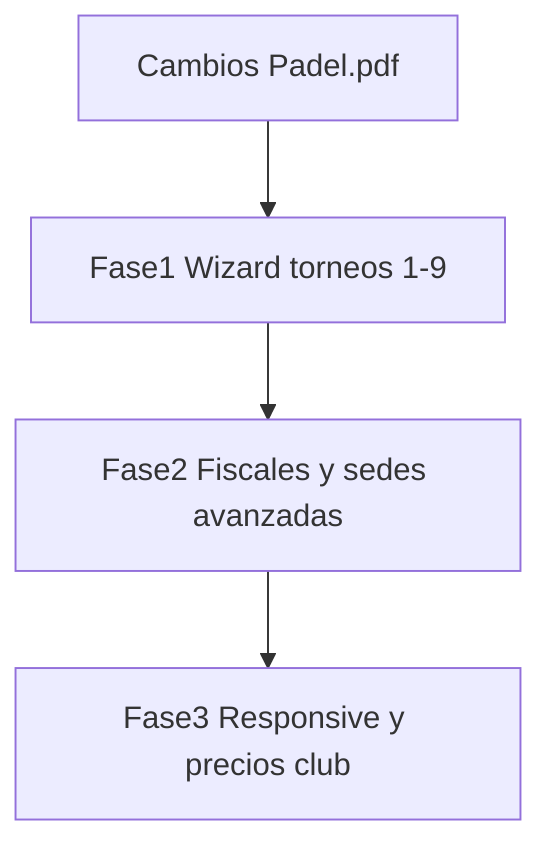

# Plan — Cambios Padel (video / PDF anotado)

Fuente de verdad: `Cambios Padel.pdf` (anotaciones del video del cliente).

**Ya hecho (Oleada A — no rehacer):** Star Point excluyente; rename Arbitraje→Resultados + agrupación por zona (base); add/quitar pareja en llave + auditoría + no destructivo; auto `asociacion_id` FAP; PDF hoja de ruta.

**Enfoque:** 3 fases. Al implementar, empezar por **Fase 1 (torneos)**. Fase 2 y 3 quedan especificadas para no perder ítems del PDF.

---

## Mapa PDF → estado

| Pedido del cliente | Estado | Fase |
|---|---|---|
| Responsive dashboard admin/club (pantallas medianas) | Parcial | 3 |
| Paso 8: quitar selector “parejas por zona”; auto FAP (3 default, resto → zonas de 4) | Parcial (lógica API existe, UI manual) | 1 |
| Paso 8: zonas ordenadas + imprimir | Falta print de zonas | 1 |
| Llave: origen por zona / clasifica a; editar = agregar/quitar/**editar**; estructura se redibuja; ventajas cabezas de serie | Parcial (add/quitar sin zona-origen ni menú “editar”) | 1 |
| Paso 9: formato zonas; siempre 3 sets; sin arbitraje; responsive | Parcial | 1 |
| Sede/org: solo FAP o asociaciones FAP; Nacional ⇒ FAP; federación sin alcance local/privado | Falta | 1 |
| Paso 1: centro de cómputos acá (no en modal create); org FAP; reglamento funcional; Amateur solo club | Parcial | 1 |
| Paso 2 logos: recomendaciones de tamaño/cuadrado | Falta | 1 |
| Paso 3: carnet = validar carnet FAP; **quitar precio** | Parcial | 1 |
| Paso 4: federación sin método de pago; solo pagó/no pagó | Falta | 1 |
| Paso 5: repartir canchas por categoría; hora fin opcional; inicio obligatorio | Falta | 2 |
| Paso 7 Star Point | Hecho | — |
| Paso 6: fiscales = autoridades; quitar cuerpo arbitral; fiscal general/auxiliares; ficha jugador | Parcial | 2 |
| Clubes reservas: precios masivos % / monto | Falta (stub sin cablear) | 3 |

---

## Fase 1 — Wizard torneos (prioridad)

### 1.1 Paso 1 — Datos + create modal
Archivos: `Paso1Datos.tsx`, `TorneoModal.tsx`, `fapApaRules.ts`, `torneo.service.ts`.

- Quitar selección de sede/club del **modal de creación**; el **Centro de Cómputos** se elige editable en Paso 1.
- Asociación organizadora: FAP o asociaciones del ecosistema FAP (filtrar padrón); si alcance **Nacional** → forzar FAP.
- Si contexto federación nacional: alcances permitidos **sin Local/Privado**.
- Reglamento: FAP/APA funcionales para categorías/siembra; **Amateur/Independiente** oculto o bloqueado para roles de federación (solo club / asociación local).

### 1.2 Paso 2 — Logos
Archivo: `Paso2Logos.tsx`.

- Texto de recomendación (ej. cuadrado 512×512 o 1:1, PNG/WebP, peso máx.).
- Validación suave en cliente (aviso si ratio muy distinto); sin bloquear upload salvo tamaño absurdo.

### 1.3 Paso 3 — Categorías / carnet
Archivos: `Paso3Categorias.tsx`, `inscripcion.service.ts`.

- Checkbox “exige carnet federativo” **sin campo de precio**.
- Si está activo: validar licencia ACTIVA asociada a FAP al inscribir (ambos jugadores si duplas); si inactivo, no exigir.

### 1.4 Paso 4 — Jugadores / pago
Archivos: `ConfirmarPagoModal.tsx`, `Paso4Jugadores.tsx`.

- Si torneo de federación (alcance Nacional / reglamento FAP / rol federación): ocultar método de pago; solo checkbox **Pagó / No pagó** (estado confirmado).
- Fuera de federación: mantener métodos actuales o el mismo checkbox según contexto club.

### 1.5 Paso 8 — Cuadros / zonas auto + print
Archivos: `BracketEditor.tsx`, `competencia.service.ts` (`getZonasFAP`), `grillaPdf.ts`.

- **Eliminar** UI “Parejas por Zona” (3/4).
- Generar siempre con lógica FAP: preferir 3; si sobran 2 → dos zonas de 4 (ya en `getZonasFAP` con `preferredSize=3`); fijar `S=3` en API/FE.
- Mostrar resumen legible de capacidades (“N zonas de 3 + M de 4”).
- Botón **Imprimir zonas** (PDF): tablas ordenadas por zona con seeds/cabezas de serie.

### 1.6 Llave de campeonato (completar)
Archivos: `BracketEditor.tsx`, `MatchCard.tsx`, `torneo.service.ts`.

- En cada slot: badge **origen de zona** (Zona A 1º / Zona B 2º) cuando venga de fase grupos.
- Menú Editar unificado: **Agregar pareja** | **Quitar pareja** | **Editar pareja** (reasignar slot con motivo — ya hay modal; integrar al menú).
- Feedback al agregar/quitar: cuántas quedan en llave / slots libres; redibujo del árbol.
- Mantener redistribución no destructiva y ventaja de 1ros / cabezas de serie.

### 1.7 Paso 9 — Resultados
Archivos: `Paso9Arbitraje.tsx` / `LiveArbitrajeRow`.

- Refinar layout tipo Paso 8 (menos corte/dispersión en pantallas medianas).
- UI de carga: **siempre 3 sets** visibles (el 3º puede ser STB según cierre).
- Limpiar copy residual “arbitraje” en UI visible.

---

## Fase 2 — Sedes y fiscales

### 2.1 Paso 5 — Sedes / canchas × categorías
- Asignar rangos de canchas por categoría del torneo (ej. 1–3 cat A, 4–6 cat B).
- `hora_inicio` requerida; `hora_fin` opcional por franja/cancha.

### 2.2 Paso 6 — Fiscales
- Copy: **Autoridades** / fiscales; quitar “cuerpo arbitral”.
- Roles: fiscal general vs auxiliares.
- Interacción en ficha del jugador; no ratificar hasta fin de torneo (modelo + UI mínima).

### 2.3 Panel operativo del fiscal (Oleada B — definido)
- Dashboard: torneos asignados filtrados por alcance.
- Durante el torneo: partidos (sede/cancha/horario/estado), jugadores con DNI + carnet, acta de incidencias, PDF.
- Ficha: cambio de categoría aplicado y trazable; descalificación/sanción solo registradas (efecto competitivo pendiente Héctor).
- **Pendiente Héctor:** si el fiscal carga resultados o solo valida; si aplica sanciones o solo las deja en acta.

---

## Fase 3 — Responsive + clubes

### 3.1 Responsive CRM
- Pass en layouts dashboard/club y wizard en breakpoints `md`/`lg` (overflow menús, tablas, pasos 8–9).

### 3.2 Reservas — precios masivos
- Cablear `EdicionMasivaPrecios.tsx` + endpoint API: % o monto fijo sobre turnos seleccionados.

---

## Orden de ejecución al implementar (Fase 1)

1. Paso 1 + reglas alcance/org/reglamento + modal create
2. Paso 2 logos tips
3. Paso 3 carnet sin precio + validación
4. Paso 4 pago federación
5. Paso 8 zonas auto + PDF zonas
6. Llave: origen zona + menú editar completo
7. Paso 9 polish 3 sets + responsive del paso

Sin migraciones salvo que Paso 5/6 (Fase 2) necesiten columnas (`hora_fin`, tipo fiscal, ratificación).

---

## Criterios de aceptación (Fase 1)

- Create modal sin sede; Paso 1 elige centro de cómputos y org FAP filtrada.
- Nacional ⇒ FAP; federación sin alcance local.
- Amateur no disponible para admin federación.
- Sin selector manual de tamaño de zona; armado auto FAP + PDF zonas.
- Llave muestra zona de origen; menú agregar/quitar/editar con motivo.
- Carnet sin precio; pago federación = checkbox.
- Resultados por zona, 3 sets en UI, sin “Arbitraje” visible.
- Star Point sigue OK (no tocar salvo regresión).

---

## Qué NO entra en Fase 1

- Responsive global del CRM (Fase 3)
- Fiscales ficha jugador / general-auxiliar (Fase 2)
- Distribución canchas × categorías + hora fin (Fase 2)
- Precios masivos de reservas (Fase 3)
