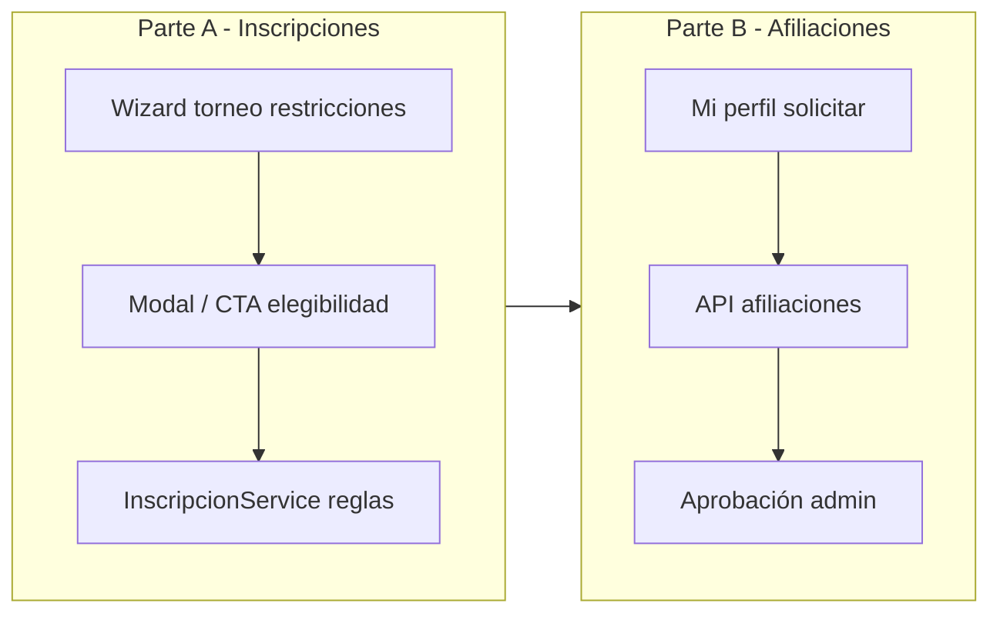

# Plan — Inscripciones a torneos + Afiliación club/federación

**Estado:** Parte A.1 lista · Parte B implementada (afiliaciones club con aprobación) — pendiente QA manual  
**Prioridad de ejecución:** primero **Parte A (inscripciones)**, después **Parte B (afiliaciones)**  
**Proyecto Supabase:** `tsmgxvygmdskhyhnjqvv`  
**Complementa:** `plan_cambios_padel.md` (§1.3 carnet) y `AGENTS.md` (reglas FAP de inscripción)

---

## 1. Objetivo

Alinear el flujo de inscripción pública (y, donde corresponda, el admin) con las restricciones reales del torneo, y habilitar que un jugador pueda asociarse a un club o a una entidad federativa (asociación / federación) de forma explícita, separada del carnet FAP.

Hoy hay desfase:

| Área | Qué existe | Qué falla |
|------|------------|-----------|
| Inscripción | Wizard configura carnet, edad, rama, cierre, categoría | El modal público casi solo mira categoría; varias reglas API están incompletas o ignoran campos del torneo |
| Afiliación | Tablas `afiliaciones`, `clubes`, `asociaciones`, `federaciones`; licencia FAP elige club | No hay flujo “asociarme”; “+ Afiliarse” reabre el modal de carnet; FKs poco usadas |



---

## 2. Principios

1. **Fuente de verdad del torneo:** lo configurado en Paso 1 / Paso 3 manda; la inscripción no inventa reglas aparte.
2. **Validar en backend siempre;** el frontend solo anticipa y explica (checklist), nunca es la única defensa.
3. **J1 y J2** se validan por igual en duplas (categoría, carnet, edad, rama).
4. **Carnet ≠ afiliación:** carnet = licencia FAP activa; afiliación = membresía a club/asociación/federación.
5. **No destructivo / auditable** donde haya override admin (inscripción manual puede saltar reglas solo con motivo explícito en una fase posterior; en A.1 se documenta el comportamiento actual).
6. **Orden DB → API → Frontend.**

---

## 3. Estado actual (baseline verificado)

### 3.1 Inscripción — archivos clave

| Capa | Path | Rol |
|------|------|-----|
| UI pública | `apps/web/app/(public)/torneos/[id]/page.tsx` | CTA: estado / cupos / auth |
| Modal | `apps/web/components/torneos/InscripcionModal.tsx` | Solo pre-check `categoria_padel === nivel` |
| FE service | `apps/web/utils/services/inscripciones.ts` | Cliente API |
| API | `apps/api/src/services/inscripcion.service.ts` | Elegibilidad + insert |
| Wizard | `apps/web/components/torneos/wizard/Paso3Categorias.tsx` | `requiere_carnet_federativo` en `reglas_arbitraje` |
| Wizard | `apps/web/components/torneos/wizard/Paso1Datos.tsx` | `fecha_cierre_inscripcion`, cupos, precio |
| Constantes | `apps/api/src/constants/fap.ts` | `DIAS_CIERRE_INSCRIPCION = 7` |

### 3.2 Validaciones actuales en `registrarInscripcion`

| Regla | Comportamiento hoy | Gap |
|-------|--------------------|-----|
| Carnet FAP | Si `reglas_arbitraje.requiere_carnet_federativo` → licencia `Activa` J1+J2 | Modal no anticipa; OK en API |
| Cierre | Hardcode 7 días antes de `torneo.fecha` | **Ignora** `fecha_cierre_inscripcion` |
| Edad | Si `validar_edad` o categoría +30/+40/… → exige `fecha_nacimiento` | **No calcula edad**; solo J1 |
| Rama | Si no Mixta, compara `sexo` del solicitante | Solo J1; `sexo === "otro"` bypasea |
| Categoría | `categoria_padel === torneo.nivel` J1+J2 | Alineado |
| Nacional | Solo admin_provincial/federación + `letraPrioridad` | Modal público no contempla |
| Cupos / duplicados | Sí | OK |
| Manual admin | Casi solo carnet + cupos | Salta edad/rama/categoría/cierre |

### 3.3 Afiliación — baseline

- Tablas: `federaciones` → `asociaciones.federacion_id` → `clubes` (**sin** `asociacion_id`) → `perfiles.club_id`.
- `afiliaciones`: `usuario_id`, `entidad` (varchar), `estado`, `club_id?`, `asociacion_id?`.
- Alta de afiliación hoy: side-effect al aprobar licencia FAP (por nombre de club).
- UI “Clubes Afiliados” en `mi-perfil` + botón que abre `LicenciaModal`.

---

# Parte A — Inscripciones alineadas a restricciones del torneo

**Meta:** que un jugador sepa *antes* de enviar si puede inscribirse, y que el backend rechace con mensajes claros si no cumple.

## A.0 Decisiones de producto (cerradas para implementación)

| # | Decisión | Valor propuesto |
|---|----------|-----------------|
| A0.1 | Carnet | Solo validación de licencia FAP `Activa`. Sin precio (`monto_carnet: 0`). Alineado a `plan_cambios_padel.md` §1.3 |
| A0.2 | Cierre de inscripción | Usar `fecha_cierre_inscripcion` si está seteada; si es `null`, fallback a regla FAP 7 días antes de `fecha` |
| A0.3 | Edad | Calcular edad al día del torneo (`torneo.fecha`). Umbral derivado de categoría (`+30`→≥30, etc.) o, si solo `validar_edad` sin umbral en nombre, exigir fecha de nacimiento y documentar umbral configurable en follow-up |
| A0.4 | Rama | Validar J1 y J2. Si falta `sexo` en perfil → bloquear con mensaje a completar perfil. `otro` no bypasea: bloquear en ramas no mixtas |
| A0.5 | Pertenencia club/fed del torneo | **Fuera de A.1.** Se habilita en Parte B + posible flag de torneo en A.2 |
| A0.6 | Inscripción manual admin | En A.1: **mantener** skips actuales; agregar comentario/TODO. En A.2 opcional: flag `omitir_validaciones` + `motivo` auditable |
| A0.7 | Torneos Nacionales | Mantener regla admin-only en API; UI pública no ofrece inscripción self-service a Nacional |

## A.1 — Slice de implementación (primero)

### A.1.1 Backend — `InscripcionService`

**Archivo:** `apps/api/src/services/inscripcion.service.ts`

1. **Select unificado del torneo** (una sola query):
   - `fecha`, `fecha_cierre_inscripcion`, `nivel`, `categoria`, `rama`, `validar_edad`, `cupos_*`, `estado`, `alcance`, `reglas_arbitraje`, `modalidad`
2. **Helper `assertInscripcionAbierta(torneo)`**
   - Si `estado` no permite inscripción → error
   - Si `fecha_cierre_inscripcion` → rechazar si `now > cierre`
   - Else → regla FAP 7 días antes de `fecha`
3. **Helper `assertCarnetSiCorresponde`** (ya existe lógica; reutilizar)
4. **Helper `assertCategoria(perfil, torneo.nivel)`**
5. **Helper `assertRama(perfil, torneo.rama)`** — J1 y J2; falta sexo → error perfil incompleto
6. **Helper `assertEdad(perfil, torneo)`**
   - Determinar `edadMinima` desde `categoria` (regex `+30|+40|+50|+60`) o mapa FAP si existe
   - Si `requiereEdad` y hay umbral: `edadEnFechaTorneo >= umbral`
   - Si `requiereEdad` sin umbral parseable: al menos exigir `fecha_nacimiento` (comportamiento actual + log/warning interno)
7. **Cargar perfil J2 completo** (`categoria_padel`, `fecha_nacimiento`, `sexo`, no solo categoría)
8. Aplicar helpers a J1 y J2 en orden estable (abierta → carnet → categoría → rama → edad → duplicados → cupos)
9. Mensajes de error en español, accionables (“Completá sexo en tu perfil”, “Tu compañero no tiene carnet FAP activo”)

**Opcional A.1:** endpoint liviano de preflight  
`GET /inscripciones/elegibilidad?torneo_id=&usuario2_email?`  
Devuelve `{ ok, checks: [{ code, label, passed, message? }] }` para el modal.  
Si se prefiere evitar endpoint nuevo en A.1: el modal calcula checks en cliente con datos de perfil + torneo y deja el backend como autoridad final.

**Recomendación A.1:** empezar **sin** endpoint nuevo (checks en cliente + misma lógica documentada); si el modal crece o divergen reglas, agregar preflight en A.2.

### A.1.2 Frontend — detalle de torneo + modal

**Archivos:**

- `apps/web/app/(public)/torneos/[id]/page.tsx`
- `apps/web/components/torneos/InscripcionModal.tsx`
- Tipos: `apps/web/utils/types/torneo.types.ts` (exponer `requiere_carnet_federativo` desde `reglas_arbitraje` al mapear torneo, no como columna fantasma sin hydrate)
- Service de lectura de torneo si hoy no aplana `reglas_arbitraje`

**CTA (`page.tsx`):**

Orden de prioridad del botón:

1. Ya inscripto → “Ver mi inscripción”
2. Estado cerrado / no inscripción → “Inscripciones cerradas”
3. Pasó `fecha_cierre_inscripcion` (o fallback 7 días) → “Inscripciones cerradas”
4. Cupos llenos → “Cupos agotados”
5. No auth → “Ingresar para inscribirte”
6. Perfil incompleto para este torneo (falta DNI/sexo/fecha si la regla lo pide) → “Completar perfil”
7. Categoría / carnet / rama / edad fallidos → botón deshabilitado o “No elegible” + abrir modal en modo explicación
8. OK → “Inscribirme” / “Inscribir mi dupla”

**Modal (`InscripcionModal.tsx`):**

- Bloque “Requisitos del torneo” (checklist):
  - Categoría requerida vs perfil
  - Carnet requerido: sí/no + estado licencia del usuario
  - Rama + sexo perfil
  - Edad (si aplica) + cálculo vs umbral
  - Cierre: fecha límite visible
- En duplas: al ingresar email J2, si hay endpoint preflight usarlo; si no, validar al submit y mostrar error API (mínimo A.1). Mejora A.2: lookup compañero y checklist J2.
- Links rápidos: “Ir a mi perfil”, “Solicitar carnet” (si falta licencia y el torneo exige carnet)
- No habilitar submit si checks locales de J1 fallan

### A.1.3 Tipos y mapeo

- Al obtener torneo, aplanar:
  ```ts
  requiere_carnet_federativo: Boolean(reglas_arbitraje?.requiere_carnet_federativo)
  ```
- Asegurar que el detalle público traiga `reglas_arbitraje`, `validar_edad`, `rama`, `fecha_cierre_inscripcion`, `nivel`, `categoria`, `modalidad`, `estado`

### A.1.4 Fuera de scope A.1

- Exigir pertenencia al club/asociación del torneo
- Rework inscripción manual + auditoría de overrides
- Cobro de carnet / `monto_carnet`
- Cambios de wizard Paso 3 (ya guarda flag sin precio; solo verificar que el FE lea el flag)

### A.1.5 Criterios de aceptación — Parte A.1

- [x] Torneo **con** carnet: jugador sin licencia Activa no puede inscribirse; mensaje claro; modal muestra requisito antes del submit
- [x] Torneo **sin** carnet: inscripción sin licencia OK (si cumple resto)
- [x] `fecha_cierre_inscripcion` en el pasado → CTA y API rechazan; si es `null`, aplica regla 7 días
- [x] Categoría distinta → bloqueo form + API
- [x] Rama Masculina/Femenina: sexo incorrecto o ausente → bloqueo; Mixta OK
- [x] Categoría +40 (o similar) con `validar_edad`: menor al umbral → bloqueo; sin fecha nacimiento → bloqueo
- [x] Dupla: J2 sin categoría/carnet/rama/edad válida → error API con etiqueta Jugador 2
- [x] Lint/build del slice FE+API OK (`tsc --noEmit`)

### A.1.6 Orden de commits sugerido (cuando se implemente)

1. `feat(back): alinear validaciones de inscripción con restricciones del torneo`
2. `feat(front): checklist de elegibilidad en inscripción pública a torneos`

---

## A.2 — Mejoras siguientes (después de A.1 / puede solaparse con B)

1. [x] Endpoint `GET /inscripciones/elegibilidad` (checks J1+J2)
2. [x] Lookup de compañero por email antes del submit (nombre, categoría, carnet)
3. [x] Inscripción manual: mismas reglas por defecto; `omitir_validaciones` + `motivo` + auditoría
4. [x] Flag `reglas_arbitraje.requiere_afiliacion_organizadora` (validación en API)
5. [ ] Tests unitarios de helpers de edad/cierre/rama en API (sin runner en `apps/api` aún)

---

# Parte B — Asociarse a club o federación

**Meta:** flujo de primer nivel en “Mi perfil” para solicitar / ver / cancelar afiliación, distinto del carnet FAP.

## B.0 Decisiones de producto (a confirmar antes de codear B)

| # | Pregunta | Propuesta default |
|---|----------|-------------------|
| B0.1 | ¿Aprobación admin para afiliarse a club? | **Sí** — estados `Pendiente` → `Activa` / `Rechazada` |
| B0.2 | ¿“Federación” = federación nacional y/o asociación provincial? | Jugador elige **club** (obligatorio) y opcionalmente se deriva asociación por FK; afiliación directa a federación solo si el producto lo pide (fase B.2) |
| B0.3 | ¿Una sola afiliación activa a club o varias? | **Varias** permitidas en `afiliaciones`; `perfiles.club_id` = club “principal” (última Activa o elegida) |
| B0.4 | Relación con carnet | Pedir carnet sigue eligiendo club; al aprobar licencia, crear/actualizar afiliación con **FKs** (`club_id`), no solo `entidad` string |

## B.1 — Database

Orden DB-first:

1. Migración: `clubes.asociacion_id` (nullable FK → `asociaciones`)
2. Backfill opcional por provincia (script/SQL one-shot) donde el matching sea inequívoco; resto manual admin
3. Asegurar uso de `afiliaciones.club_id` / `asociacion_id` en inserts
4. Índice: `(usuario_id, club_id)` unique parcial donde `estado IN ('Pendiente','Activa')` para evitar duplicados
5. Estados canónicos: `Pendiente`, `Activa`, `Rechazada`, `Baja` (alinear strings existentes)

**Sin** agregar `federacion_id` a perfiles en B.1 salvo necesidad; se deriva: club → asociación → federación.

## B.2 — Backend

Nuevo módulo:

- `apps/api/src/services/afiliacion.service.ts`
- `apps/api/src/controllers/afiliacion.controller.ts`
- `apps/api/src/routes/afiliacion.routes.ts`

Endpoints sugeridos:

| Método | Ruta | Quién | Qué |
|--------|------|-------|-----|
| POST | `/api/afiliaciones` | usuario | Solicitar (`club_id`) → `Pendiente` |
| GET | `/api/afiliaciones/mias` | usuario | Listar propias |
| DELETE/PATCH | `/api/afiliaciones/:id/cancelar` | usuario | Cancelar pendiente o pedir baja |
| GET | `/api/afiliaciones` | admin* | Listar pendientes / filtrar |
| PATCH | `/api/afiliaciones/:id/estado` | admin* | Aprobar / rechazar |

\* Roles: `admin`, `superadmin`, `admin_federacion`, `admin_provincial` (y opcional `admin_club` solo su `club_id`).

Al aprobar:

- `estado = Activa`
- setear `entidad` = nombre club (compat rankings)
- setear `club_id`, `asociacion_id` (desde club)
- opcional: actualizar `perfiles.club_id` si no tiene principal

Ajustar `LicenciaService.cambiarEstado` para reutilizar el mismo helper de afiliación (no lógica duplicada por string).

## B.3 — Frontend

1. `mi-perfil`: sección “Mis afiliaciones” con estados; botón **Asociarme a un club** → modal propio (`AfiliacionModal`), **no** `LicenciaModal`
2. Modal: provincia → lista clubes → confirmar solicitud
3. CTA “Solicitar carnet FAP” permanece separado
4. Ajustes de perfil: mostrar club principal (read-only o selector entre Activas)
5. CRM admin: cola de solicitudes de afiliación (página o tab en usuarios/clubes)

## B.4 — Criterios de aceptación — Parte B

- [x] Jugador solicita afiliación a club sin pasar por carnet
- [x] Admin aprueba → aparece en perfil como Activa con FK
- [x] Duplicado pendiente/activa al mismo club → rechazado
- [x] Licencia aprobada también deja afiliación consistente (FK + entidad)
- [ ] Rankings/brackets siguen resolviendo nombre de club (preferir FK, fallback `entidad`) — sin cambios de ranking en este slice; fallback entidad se mantiene

## B.5 — Commits sugeridos

1. `feat(back): agregar afiliaciones de jugadores a clubes con aprobación`
2. `feat(front): flujo de asociarse a un club desde mi perfil`

---

## 4. Orden de ejecución global

```text
1. Parte A.1 Backend validaciones inscripción
2. Parte A.1 Frontend checklist + CTA
3. Verificación manual (torneos con/sin carnet, cierre, edad, rama, duplas)
4. Parte A.2 (preflight / manual auditable) — opcional según tiempo
5. Parte B.0 confirmar decisiones producto
6. Parte B.1 migración clubes.asociacion_id
7. Parte B.2 API afiliaciones + wire licencia
8. Parte B.3 UI perfil + admin
9. (Opcional) A.2.4 flag torneo exige afiliación organizadora
```

---

## 5. Riesgos y mitigaciones

| Riesgo | Mitigación |
|--------|------------|
| Edad sin umbral claro en categoría “Veteranos” libre | Mapa explícito + si no hay umbral, solo exigir fecha_nacimiento y no inventar años |
| Torneos viejos sin `fecha_cierre_inscripcion` | Fallback 7 días documentado |
| `reglas_arbitraje` mal tipado / no mapeado al FE | Aplanar en service/mapper de torneos |
| Afiliaciones históricas solo con `entidad` string | Lectura: FK primero, fallback nombre; escritura nueva siempre con FK |
| Romper inscripción manual de operadores | No cambiar skips en A.1; documentar |

---

## 6. Preguntas abiertas (no bloquean A.1)

1. Umbral exacto FAP para “Veteranos” / “Ladies” sin `+N` en el nombre — ¿edad mínima fija o solo fecha de nacimiento?
2. ¿Inscripción manual debe respetar las mismas reglas en el corto plazo (A.2) o queda override libre?
3. Parte B: ¿aprobación siempre, o auto-activa para clubes “abiertos”?
4. ¿Hace falta afiliación directa a federación nacional sin pasar por club?

---

## 7. Próximo paso inmediato

**Implementar Parte A.1** en este orden:

1. Backend: helpers de cierre / edad / rama / perfiles J2  
2. Frontend: mapeo `requiere_carnet_federativo` + checklist en `InscripcionModal` + CTA en detalle  
3. Probar con un torneo que exija carnet y otro que no  

Este documento es la fuente de verdad de este trabajo; al cerrar A.1, marcar checkboxes y actualizar estados aquí o en `plan_cambios_padel.md` §1.3.
